# User Guide: The Library IEC60730 Integration

This document provides instructions for integrating the Library IEC60730 into a project.

This will guide the developer to install the required software. Then guide the configuration of a project and integrate the source code into the project.

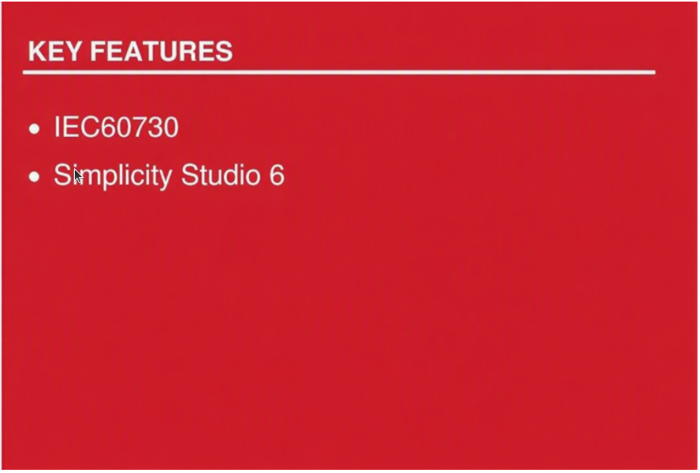


SILICON LABS

## Contents

[Contents](#contents)

[Table of pictures](#table-of-pictures)

[1. Background](#1-background)

[2. Install the required software](#2-install-the-required-software)

[3. Add an extension to Simplicity Studio](#3-add-an-extension-to-simplicity-studio)

[4. Generate an example project](#4-generate-an-example-project)

[5. Edit the post-build steps](#5-edit-the-post-build-steps)

[6. Add the source code to the project](#6-add-the-source-code-to-the-project)

[7. Integrate code into the project](#7-integrate-code-into-the-project)

[8. Revision history](#8-revision-history)

## Table of pictures

[Figure 1 Adding Extension to SDK](#figure-1-adding-extension-to-sdk)

[Figure 2 Browse to extension location](#figure-2-browse-to-extension-location)

[Figure 3 Create new project](#figure-3-create-new-project)

[Figure 4 Example Project Selection](#figure-4-example-project-selection)

[Figure 5 Project Configuration](#figure-5-project-configuration)

[Figure 6 Project generation in workspace](#figure-6-project-generation-in-workspace)

[Figure 7 Build Project](#figure-7-build-project)

[Figure 8 CRC-16 and CRC-32 scripts](#figure-8-crc-16-and-crc-32-scripts)

[Figure 9 Output command from the Post-build Steps](#figure-9-output-command-from-the-post-build-steps)

[Figure 10 Result after Post-build complete](#figure-10-result-after-post-build-complete)

[Figure 11 Components support library IEC60730](#figure-11-components-support-library-iec60730)

[Figure 12 Add source code library IEC60730](#figure-12-add-source-code-library-iec60730)

[Figure 13 Assembly code algorithm MARCHC for GCC compiler](#figure-13-assembly-code-algorithm-marchc-for-gcc-compiler)

[Figure 14 Flow chart of the library IEC60730](#figure-14-flow-chart-of-the-library-iec60730)

[Figure 15 Demo OEM files integrated with Library IEC60730](#figure-15-demo-oem-files-integrated-with-library-iec60730)

[Figure 16 Configuration for watchdog module](#figure-16-configuration-for-watchdog-module)

[Figure 17 Configuration for system clock module](#figure-17-configuration-for-system-clock-module)

## 1. Background

The IEC60730 is a safety standard used in household applications. It defines the test and diagnostic method that ensures the safe operation of devices. We provide the test of the following components: CPU registers, variable memory check, invariable memory check, program counter check, clock check, and interrupt check.

At the time of this writing, the library IEC60730 has been tested on two devices EFR32xG23 and EFR32xG24 on Simplicity Studio 6 (SS6) with toolchain GNU ARM v12.2.1 and SDK version 2026.6.0.

## 2. Install the required software.

We use the third-party software [SRecord](http://srecord.sourceforge.net/) to calculate CRC value. Firstly, you need to install this software. If you're using Windows OS, you can go to the link of this software (link above), download the installation, and run the installer to install. If you're using Ubuntu OS, please follow the installation instructions below.

```sh
$ sudo apt update
$ sudo apt install srecord
```

## 3. Add an extension to Simplicity Studio

The safety library IEC60730 is supported by adding the IEC60730 extension, which is built using the software environment.:

- OS-Ubuntu 20.04

- Simplicity Studio 6

- Simplicity SDK Suite v2026.6.0

This project is organized as an extension of Simplicity Studio. This project is built upon SSDK version 2026.6.0, GNU toolchain V12.2.1. The user can download the same version of SSDK from `PACKAGES > PACKAGES MANAGER > Simplicity SDKs > Add new SDK > Simplicity SDK 2026.6.0` and Simplicity Studio V6 download link [Simplicity Studio V6](https://www.silabs.com/software-and-tools/simplicity-studio?tab=getting-started).

To create and build demo projects, the user must add the IEC60730 extension to Simplicity Studio. The procedure would be `SETTING > SDKs > Simplicity SDK Suite v2026.6.0 > Add Extension`.

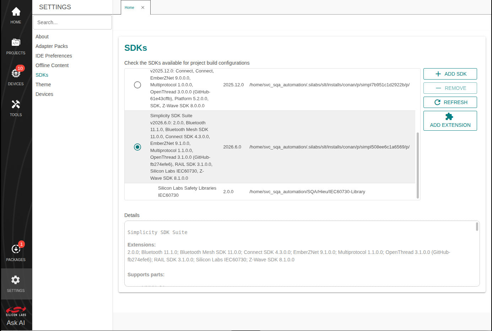
###### Figure 1 Adding Extension to SDK


Press `Browse` to find the directory of this extension. Then choose the folder that has the file name `iec60730.slce`. Simplicity Studio will detect SDK extensions automatically. Click `OK` then `Apply and Close`

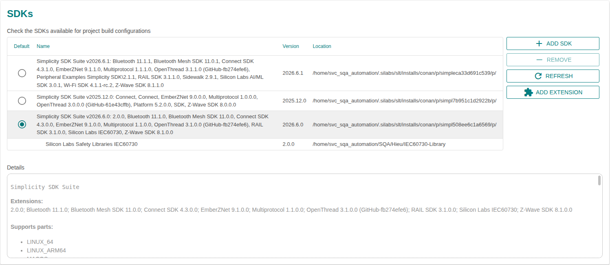
###### Figure 2 Browse to extension location

## 4. Generate an example project.

Before using Simplicity Studio to generate the project, you need to add the IEC60730 extension. Please remember the following text:
> `"This extension supports a demo example for EFR32MG families"`

Start a project, select `DEVICES` and choose `Devices you can connect`. For example, you can select `EFR32FG23 2.4GHz 20 dBm Radio Board (Rev A00)` in the Target Boards section, with the Target Device set to `EFR32FG23B020F512IM48` as shown in the image below.

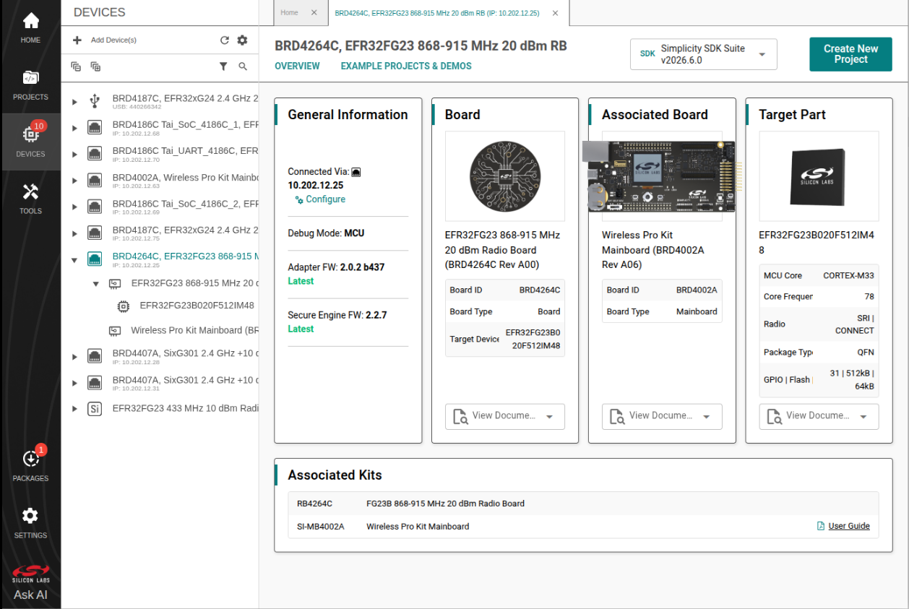
######  Figure 3 Create new project

To create a new Simplicity Studio® 6 (SSv6) project, follow these three dialog steps:

- Target, SDK, and Toolchain

- Examples

- Configuration

An indicator at the top of the dialog will show you your current position in the process. You can click `Back` at any time to return to a previous dialog if you need to make changes.

In `Example Project Selection`, use the checkboxes or keywords to find the example of interest. To create a radio board example IEC60730 Demo, search the keyword `iec60730` in the search box, related examples will show. Choose `IEC60730 Example Demo`. Click `Create`

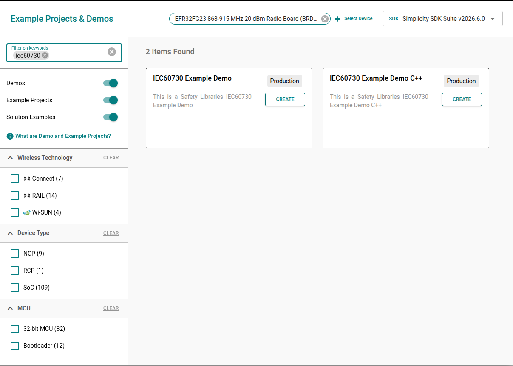
###### Figure 4 Example Project Selection

In `Project Configuration Selection`, rename and location your project if you want. For the three selections under `Copy contents`, you can choose any of the selections you want.

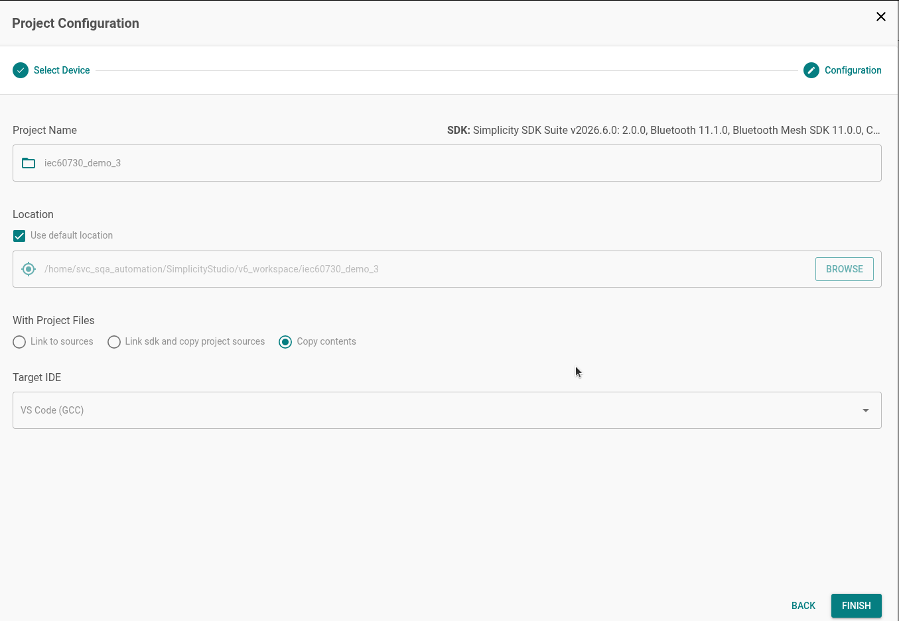
###### Figure 5 Project Configuration

Once you finish project creation, the Simplicity IDE perspective opens. There may be a slight delay in the initial configuration.

The project typically opens `README tab`, which contains an example project description, and `OVERVIEW tab`.

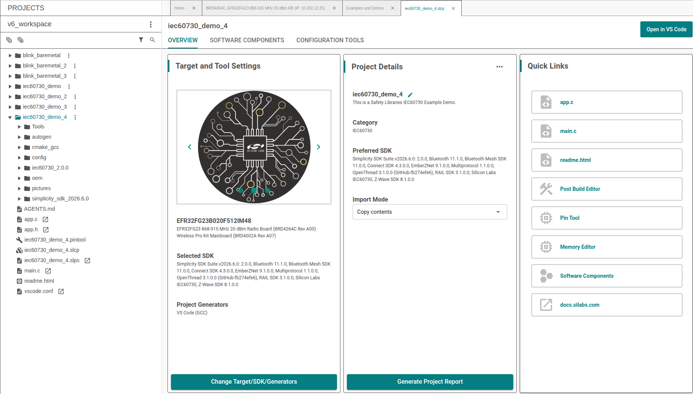
###### Figure 6 Project generation in workspace

For building the project, select `Open in VS Code` to synchronize the project with Visual Studio Code. Then, open the Extensions view in VS Code and install the `Simplicity Studio for VS Code` extension. After installation, click the hammer icon to build the project, or right-click the project and select Build Project.

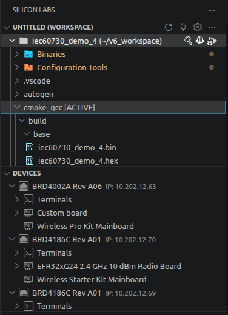
###### Figure 7 Build Project


## 5. Edit the post-build steps.

By default, after building the project, firmware files in `*.bin`, `*.hex`, and `*.s37` formats will be created.

Modify the post-build steps so new firmware images are generated with a CRC value written into FLASH at the `check_sum` symbol. Scripts `sl_iec60730_cal_crc16.sh` and `sl_iec60730_cal_crc32.sh` produce `*_crc16` / `*_crc32` images (documented generically as `*_crcNN`). They run on Windows and Ubuntu and live under `iec60730_<version>/lib/crc/`.

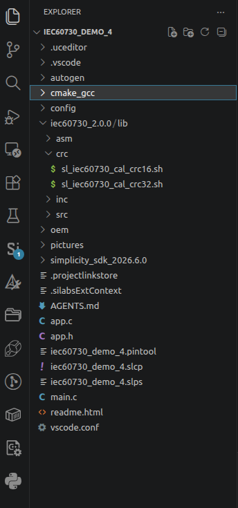
###### Figure 8 CRC-16 and CRC-32 scripts

Detailed parameters are described in **Support calculate CRC**.

> **Important — customer notice (CRC-16 production path)**
>
> When **`SL_IEC60730_CRC_DEBUG_ENABLE` is disabled (`0`)** and **`SL_IEC60730_USE_CRC_32_ENABLE` is disabled (`0`)** (default CRC-16 mode in `config/sl_iec60730_config.h`):
>
> 1. The post-build step **must** run `sl_iec60730_cal_crc16.sh` so a `*_crc16` image is generated with the reference CRC stored at `check_sum`.
> 2. You **must flash** the `*_crc16` firmware (`*.bin` / `*.hex` / `*.s37`), **not** the plain image without the CRC suffix.
> 3. The address list passed to the script **must match** the Flash regions used at runtime in OEM IMC configuration (for example in `oem_iec60730.c`). Otherwise runtime `iec60730_ref_crc` and stored `SL_IEC60730_REF_CRC` (`check_sum`) will differ and IMC POST/BIST will fail.
>
> - If `SL_IEC60730_USE_CRC_32_ENABLE` is enabled (`1`), use `sl_iec60730_cal_crc32.sh` and flash `*_crc32` instead.
> - If `SL_IEC60730_CRC_DEBUG_ENABLE` is enabled (`1`), IMC compares against the runtime-calculated reference and does not require a matching stored `check_sum`; the CRC post-build image is still recommended for production builds.

### Studio-style example (GCC)

Single continuous region (start address to `check_sum`):

```bash
arm-none-eabi-objdump -t -h -d -S '${BuildArtifactFileBaseName}.axf' >'${BuildArtifactFileBaseName}.lst' && bash ${ProjDirPath}/iec60730_2.0.0/lib/crc/sl_iec60730_cal_crc16.sh ${BuildArtifactFileBaseName} "<path_build_dir>" "<path_srecord_bin>" GCC "0x8000000"
```

Multiple regions (must match OEM Flash IMC regions; demo GCC offsets example):

```bash
arm-none-eabi-objdump -t -h -d -S '${BuildArtifactFileBaseName}.axf' >'${BuildArtifactFileBaseName}.lst' && bash ${ProjDirPath}/iec60730_2.0.0/lib/crc/sl_iec60730_cal_crc16.sh ${BuildArtifactFileBaseName} "<path_build_dir>" "<path_srecord_bin>" GCC "0x8000000 0x8000050 0x80000a0 0x80000f0 0x8000140 0x8000190"
```

These six addresses are **three start/end pairs**. They come from the demo OEM table in `oem_iec60730.c` (`OEM_FLASH_OFFSET = 20` words → `0x50` bytes per region, with one-region gaps). See **Section 7.2** for the OEM code to modify and why multiple regions are used.

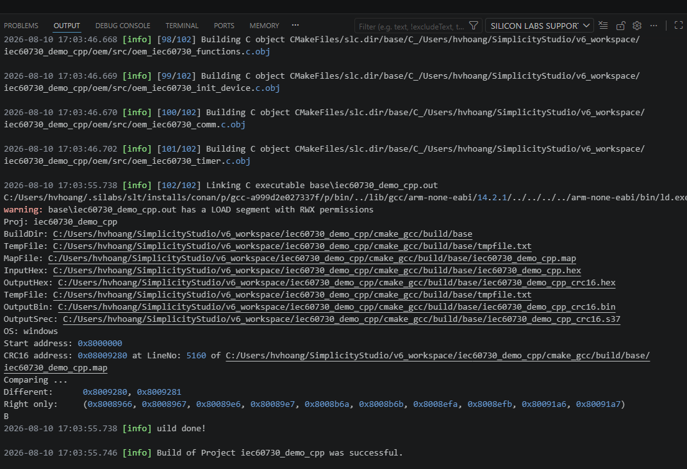
###### Figure 9 Output command from the Post-build Steps

### Add post-build CRC (CMake)

Apply CRC post-build in `cmake_gcc/CMakeLists.txt`. Append to the existing `POST_BUILD` (after `.s37` / `.hex` / `.bin`). Do **not** wrap the CRC invocation in `bash -c "..."` — nested quotes break under Windows `cmd.exe`. On Windows, `bash` must be available (MSYS / MinGW / Cygwin / Git Bash).

Example for CRC-16 (`SL_IEC60730_USE_CRC_32_ENABLE` disabled), multi-region list aligned with the demo OEM Flash IMC regions:

```cmake
add_custom_command(TARGET iec60730_demo
    POST_BUILD
    COMMAND ${CMAKE_OBJCOPY} ${OBJCOPY_SREC_CMD} "$<TARGET_FILE:iec60730_demo>" "$<TARGET_FILE_DIR:iec60730_demo>/$<TARGET_FILE_BASE_NAME:iec60730_demo>.s37"
    COMMAND ${CMAKE_OBJCOPY} ${OBJCOPY_IHEX_CMD} "$<TARGET_FILE:iec60730_demo>" "$<TARGET_FILE_DIR:iec60730_demo>/$<TARGET_FILE_BASE_NAME:iec60730_demo>.hex"
    COMMAND ${CMAKE_OBJCOPY} ${OBJCOPY_BIN_CMD}  "$<TARGET_FILE:iec60730_demo>" "$<TARGET_FILE_DIR:iec60730_demo>/$<TARGET_FILE_BASE_NAME:iec60730_demo>.bin"
    # .lst + CRC-16 (*_crc16.bin/hex/s37). Use bash on Windows (MSYS/MinGW/Cygwin).
    COMMAND ${CMAKE_OBJDUMP} -t -h -d -S "$<TARGET_FILE:iec60730_demo>" > "$<TARGET_FILE_DIR:iec60730_demo>/$<TARGET_FILE_BASE_NAME:iec60730_demo>.lst"
    COMMAND bash "${CMAKE_CURRENT_LIST_DIR}/../iec60730_2.0.0/lib/crc/sl_iec60730_cal_crc16.sh"
            "$<TARGET_FILE_BASE_NAME:iec60730_demo>"
            "$<TARGET_FILE_DIR:iec60730_demo>"
            "C:/Program Files/srecord/bin"
            GCC
            "0x8000000 0x8000050 0x80000a0 0x80000f0 0x8000140 0x8000190"
)
```

For a single continuous Flash range, replace the last argument with `"0x8000000"` and set OEM IMC to one region from `SL_IEC60730_ROM_START` to `SL_IEC60730_ROM_END`.

Use `sl_iec60730_cal_crc32.sh` when `SL_IEC60730_USE_CRC_32_ENABLE` is enabled. On Linux, pass `""` for the srecord path field. After a successful post-build, flash `*_crc16.*` or `*_crc32.*`, not the plain image.

> **Note**
>
>- **Required when `SL_IEC60730_CRC_DEBUG_ENABLE` is `0` and `SL_IEC60730_USE_CRC_32_ENABLE` is `0`:** run `sl_iec60730_cal_crc16.sh` in post-build and flash `<project_name>_crc16` (`*.bin` / `*.hex` / `*.s37`). The plain image does not contain a valid reference CRC at `check_sum`, so IMC will fail.
>
>- Keep the script address list identical to the Flash regions configured for IMC in your OEM code.
>
>- If, during project configuration, you choose **Link to SDK and Copy Project Structures** or **Link to Source**, copy `sl_iec60730_cal_crc16.sh` or `sl_iec60730_cal_crc32.sh` into the `lib/crc` folder of your project directory (or point the CMake path at `iec60730_<version>/lib/crc/`).
>
>- After the build completes, Post-build creates `<project_name>_crc16` or `<project_name>_crc32` files with extensions `*.bin`, `*.hex`, and `*.s37`.
---

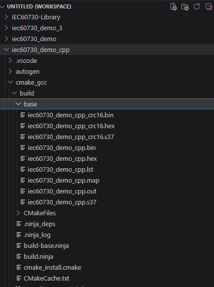
###### Figure 10 Result after Post-build complete

## 6. Add the source code to the project.

In our example, after adding the SDK extension, the software component will have a few components that support adding code files (*.c, *. s) of Library IEC60730 to the project:

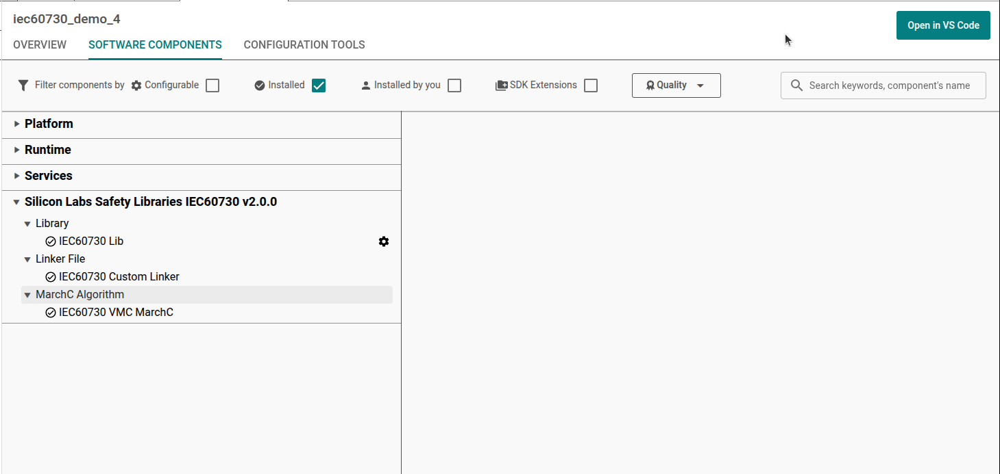
###### Figure 11 Components support library IEC60730

When you install these components, the source code library IEC60730 will be added. For example:

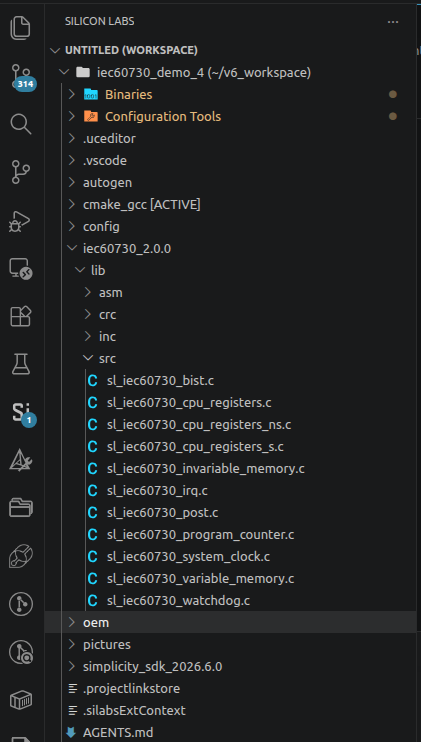
######  Figure 12 Add source code library IEC60730

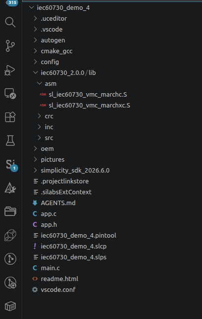
###### Figure 13 Assembly code algorithm MARCHC for GCC compiler

## 7. Integrate code into the project.

The library IEC60730 has been divided into 2 main test phases: Power on Self-Test (POST) and Build In Self-Test (BIST). [Figure 13 Flow chart of the library IEC60730](#figure-13-flow-chart-of-the-library-iec60730) shows the basics of the library IEC60730 integration into a user software solution.

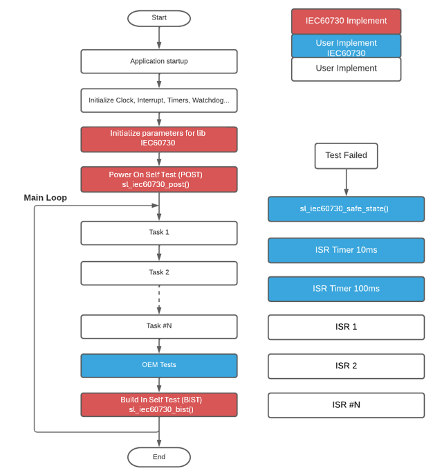
###### Figure 14 Flow chart of the library IEC60730

In our example, we have added a demo `oem` foler  (Original equipment manufacturer) to integrate with the library IEC60730 to test steps such as flow charts fully.

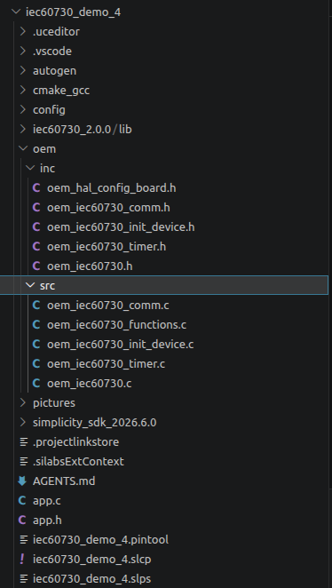
###### Figure 15 Demo OEM files integrated with Library IEC60730

If you want to add your OEM code and don't want to use our OEM files demo, you COULD add your OEM code via the following steps below:

### 1. Requires declaration and initialize variables for IEC60730 library with constant values. Refer function `oem_iec60730_init` in file `oem_iec60730.c`.

```sh
sl_iec60730_vmc_test_multiple_regions_t oem_vmc_test;
sl_iec60730_imc_test_multiple_regions_t oem_imc_test __CLASSB_RAM;
sl_iec60730_irq_cfg_t oem_irq_config;
```


These three variables are used for interrupt, invariable memory check and variable memory check.

### 2. To perform an invariable memory check, configure OEM Flash regions (must match post-build CRC script)

The IEC60730 library uses CRC for Flash (IMC). CRC can use GPCRC hardware or software via:

```c
#define SL_IEC60730_CRC_USE_SW_ENABLE
```

If hardware CRC is used, initialize GPCRC before the Flash test.

The library supports two methods:

- **Single continuous region:** from a Flash start address to `check_sum` (`SL_IEC60730_ROM_END`).
- **Multiple discontinuous regions:** start/end pairs for each area to protect (gaps between regions are **not** included in the CRC).

#### Why the demo uses multiple regions

The demo configures **three** Flash regions (not the full image) to show how IMC can protect **selected** Flash ranges when code or data is split (for example several application/image sections with unused gaps between them). That matches the multi-region capability described in the IMC library documentation.

In the demo, `OEM_FLASH_OFFSET` is counted in **`uint32_t` pointer units**. For GCC, `OEM_FLASH_OFFSET = 20` → each region is `20 × 4 = 80` bytes (`0x50`). Regions are placed with a one-region gap between them so the CRC deliberately skips the hole:

| Region | Start | End (exclusive) | Size |
| -- | -- | -- | -- |
| 0 | `0x08000000` | `0x08000050` | `0x50` |
| 1 | `0x080000A0` | `0x080000F0` | `0x50` |
| 2 | `0x08000140` | `0x08000190` | `0x50` |

Gaps `0x08000050`–`0x080000A0` and `0x080000F0`–`0x08000140` are **not** CRC’d. The post-build address list is therefore:

`0x8000000 0x8000050 0x80000a0 0x80000f0 0x8000140 0x8000190`

(start0 end0 start1 end1 start2 end2).

#### OEM code you must modify — `oem/src/oem_iec60730.c`

Highlight and edit these symbols so runtime IMC matches your product Flash map **and** Section 5 post-build script arguments:

```c
/* --- MODIFY: number of Flash IMC regions --- */
#define OEM_NUM_FLASH_REGIONS_CHECK   3

#if defined(__GNUC__)
/* --- MODIFY: region size in uint32_t words (20 words = 0x50 bytes) --- */
#define OEM_FLASH_OFFSET              20
#elif defined(__ICCARM__)
#define OEM_FLASH_OFFSET              80   /* IAR demo uses byte offsets in casts below */
#endif

#if defined(__GNUC__)
/* --- MODIFY: Flash IMC regions (must match CRC script address list) --- */
const sl_iec60730_imc_test_region_t oem_imc_region_test[OEM_NUM_FLASH_REGIONS_CHECK] =
{ { .start = SL_IEC60730_ROM_START, .end = SL_IEC60730_ROM_START + OEM_FLASH_OFFSET },
  { .start = SL_IEC60730_ROM_START + 2 * OEM_FLASH_OFFSET, .end = SL_IEC60730_ROM_START + 3 * OEM_FLASH_OFFSET },
  { .start = SL_IEC60730_ROM_START + 4 * OEM_FLASH_OFFSET, .end = SL_IEC60730_ROM_START + 5 * OEM_FLASH_OFFSET } };
#endif
```

Wire the table in `oem_iec60730_init()`:

```c
oem_imc_param.gpcrc = SL_IEC60730_DEFAULT_GPRC;
oem_imc_test.region = oem_imc_region_test;
oem_imc_test.number_of_test_regions = OEM_NUM_FLASH_REGIONS_CHECK;
sl_iec60730_imc_init(&oem_imc_param, &oem_imc_test);
```

**Single continuous region alternative** (script argument `"0x8000000"` only):

```c
#define OEM_NUM_FLASH_REGIONS_CHECK   1

const sl_iec60730_imc_test_region_t oem_imc_region_test[OEM_NUM_FLASH_REGIONS_CHECK] =
{ { .start = SL_IEC60730_ROM_START, .end = SL_IEC60730_ROM_END } };
```

The reference CRC is written at `check_sum` by the post-build script (Section 5). Flash the `*_crc16` / `*_crc32` image so runtime IMC can compare against `SL_IEC60730_REF_CRC`.

### 3. Configure Watchdog Test: this configuration determines which watchdog unit will be checked.The library does not initialize the watchdog units, the user should do the initialization. We support configuration for watchdog module

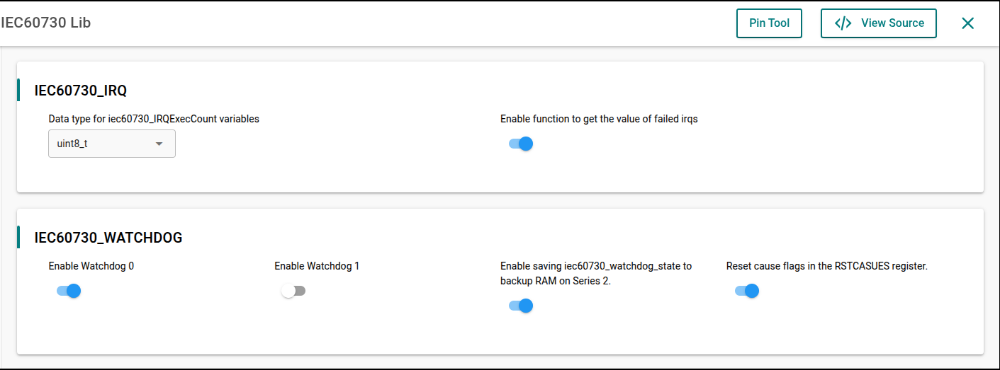
###### Figure 16 Configuration for watchdog module

The two define used to enable watchdog testing are used in the application:

```C
#define SL_IEC60730_WDOG0_ENABLE
#define SL_IEC60730_WDOG1_ENABL
```

If these macros are not enabled, it will show an error saying watchdog checking is not enabled.

- To clear reset cause flags in the RSTCASUES register after watchdog testing is completed. Enable configuration of the definition of macro `#define SL_IEC60730_RSTCAUSES_CLEAR_ENABLE`. In our demo, this feature is enabled.

- The static variable `iec60730_watchdog_count` must be located at a memory location that is not cleared when system startup `(section".ram_no_clear")`.

- The global variable `iec60730_watchdog_state` must be located at a memory location that is not cleared when system startup `(section ".ram_no_clear")`. To enable saving `iec60730_watchdog_state` to backup RAM on Series 2, enable the macro `#define SL_IEC60730_SAVE_STAGE_ENABLE`. By default, it will be disabled.Define macro `SL_IEC60730_BURAM_IDX` to select which register of the BURAM will be used. The default value is `0x0UL`.

### 4. Before calling the `sl_iec60730_post` function,we need to do the following steps:

- Configure the clock for the timers. You can refer to these configurations in our demo examples, file `oem_iec60730_init_device.c`.

- Create two timers with 10 milliseconds (ms) and 100 milliseconds (ms) interrupt periods (parameters 10ms and 100ms are recommended values) to test the clock and the clock switch. You can refer our demo example, file `oem_iec60730_timer.c` for more details. Note that adjusting the 10ms and 100ms values will require adjusting other configuration `IEC60730_SYS_CLK`:

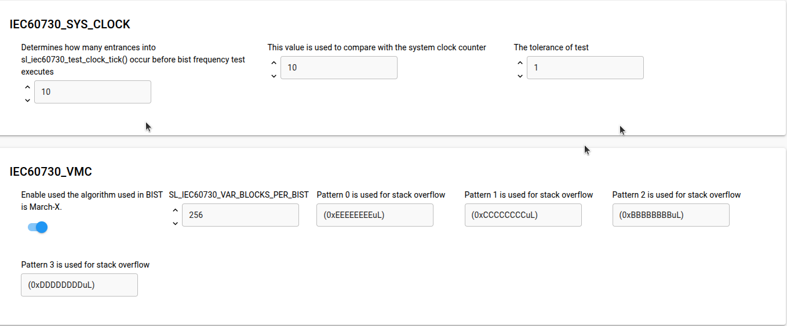
###### Figure 17 Configuration for system clock module

### 5. To perform a variable memory check, the library uses MarchC and MarchXC algorithms. It will have two options:

   - Start from the user's specified address in RAM and continue to the end of the RAM region.

   - Calculate multiple RAM regions by providing the starting and ending addresses for each one. For additional details, refer to the file `oem_iec60730.c`.

### 6. Before calling the `sl_iec60730_bist` function, we `SHOULD` set the flag for the `sl_iec60730_program_counter_check` variable. Some of the following flags are set by the Library IEC60730: `IEC60730_VMC_COMPLETE,IEC60730_IMC_COMPLETE,IEC60730_CPU_CLOCKS_COM PLETE,and IEC60730_INTERRUPT_COMPLETE`.

Other flags (IEC60730_GPIO_COMPLETE, IEC60730_ANALOG_COMPLETE,etc.) are up to you to develop additional test functions. The `sl_iec60730_program_counter_check` variable `SHOULD` set the flags corresponding to the unavailable test to ensure that the Program Counter Check is guaranteed.

In the demo examples,you will often see the following code.

```C
sl_iec60730_program_counter_check   |=IEC60730_GPIO_COMPLETE
                                    | IEC60730_ANALOG_COMPLETE
                                    | IEC60730_OEM0_COMPLETE
                                    | IEC60730_OEM1_COMPLETE
                                    | IEC60730_OEM2_COMPLETE
                                    | IEC60730_OEM3_COMPLETE
                                    | IEC60730_OEM4_COMPLETE
                                    | IEC60730_OEM5_COMPLETE
                                    | IEC60730_OEM6_COMPLETE
                                    | IEC60730_OEM7_COMPLETE;
```

- On demo eample, executes the external communication test that sets the `IEC60730_COMMS_COMPLETE` flag by itself.

- The function `sl_iec60730_bist` SHOULD be called in periodical task or a supper loop while(1).

### 7.  Remember to increment the IRQ counter variable every time the interrupt to test occurs. You can refer to the `oem_irq_exec_count_tick` function in our demo examples.


```C
void TIMERO_IRQHandler(void) {

...

oem_irq_exec_count_tick();

}

void oem_irq_exec_count_tick(void){

oem_irq_exec_count[0]++;

}

```

### 8. Create the function `sl_iec60730_safe_state`. The purpose of this function is to handle when an error occurs. An example of handling of this function refer files `oem_iec60730_functions.c`. After generating our demo example successfully, you also `COULD` add your code in file app.c and app.h

## 8. Revision history

| Revision | Date | Description |
| -- | -- | -- |
| 0.1.0 | Oct 2021 | Initial Revision |
| 0.2.0 | Nov 2021 | Section 7: Added description for Watchdog |
| 0.3.0 | Mar 2023 | Remove Section 8. |
| 0.4.0 | Apr 2023 | Update document |
| 1.0.0 | Sep 2023 | Section 1: Added mention aboutEFM32PG22 and EFR32xG22devices. |
| 1.1.0 | June 2024 | Adding Section 3 and Section 4 for support creates a Library Extension Updated other sections for suit with the released package EFR32xG12 and EFR32xG24 devices. |
| 2.0.0 | Nov 2024 | Rewrite the documentation by the re-factory code of the library support device EFR32MG families. |
| 2.1.0 | Aug 2026 | Update the documentation to reflect the extension configuration changes that add support for the EFR32FG23 device family. |


